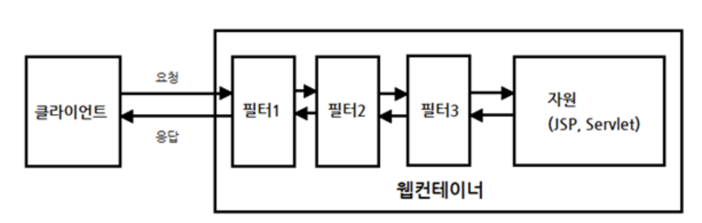
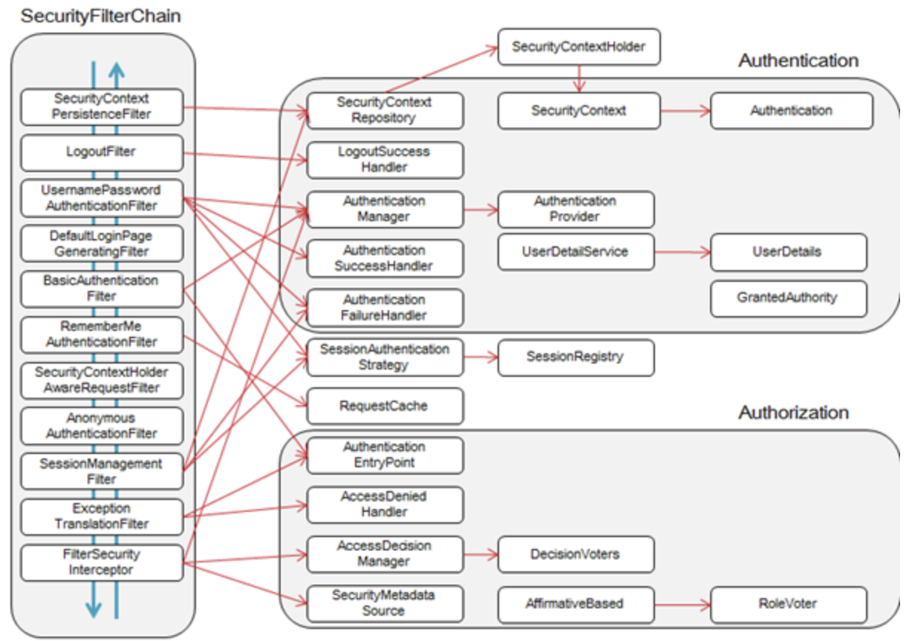
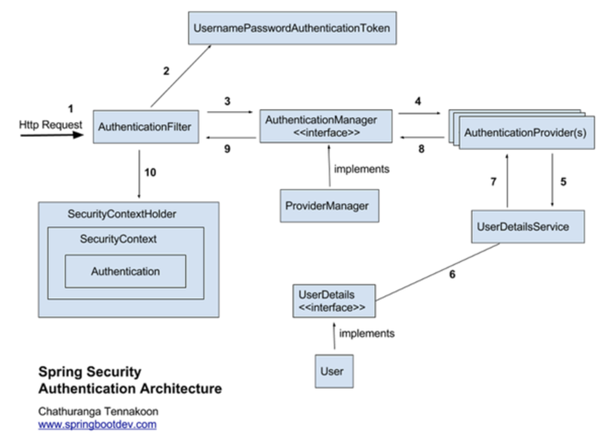

#### 최초 작성일 : 2021.09.16(목)

# Boostcourse Java Back-end 과정 학습

여기서는 Boostcourse Spring Framework Security 예제 코드 작성을 해본다.

## 학습 환경

1. OS : MacOS
2. JDK : OpenJDK 11.0.5
4. Build Tools : Maven
5. Database : MySQL
6. IDE: IntelliJ IDEA Ultimate

## 스프링 시큐리티(Spring Security)

1. 스프링 기반의 어플리케이션의 보안을 담당하는 프레임워크를 말한다.
2. 스프링 시큐리티는 `필터(Filter)` 기반으로 동작하기 때문에 스프링 MVC 와 분리되어 관리 및 동작한다.
    - 스프링 시큐리티 3.2부터는 XML로 설정하지 않고, Java Config 설정으로 간단하게 설정할 수 있게 지원하고 있다.
3. 자주 사용하는 보안 용어
    - `접근 주체(Principal)` : 보호된 대상에 접근하는 유저
    - `인증(Authentication)` : 인증은 '증명하다'라는 의미로 예를 들어, 유저 아이디와 비밀번호를 이용하여 로그인 하는 과정을 말한다.
    - `인가(Authorization)` : '권한부여'나 '허가'와 같은 의미로 사용됩니다. 즉, 어떤 대상이 특정 목적을 실현하도록 허용(Access) 하는 것을 의미한다.
    - `권한` : 인증된 주체가 애플리케이션의 동작을 수행할 수 있도록 허락되었는지를 결정할 때 사용

### 스프링 시큐리티 필터(Spring Security Filter)

1. 클라이언트는 요청을 보내고, 그 요청을 서블릿이나 JSP 등이 처리한다.
2. `스프링 MVC`에서는 가장 먼저 요청을 받는 `DispatcherServlet`이 요청 받기 전에 다양한 필터들이 있을 수 있다.
    - 필터의 역할은 클라이언트와 자원 사이에서 요청과 응답 정보를 이용해 다양한 처리를 하는데 목적이 있다.
    - 어떤 필터는 요청을 받은 후, 클라이언트가 원래 요청한 자원이 아닌 다른 자원으로 리다이렉트 시킬 수도 있다.
    - 어떤 필터는 다음 필터에게 요청과 응답을 전달하지 않고, 바로 클라이언트에게 응답하고 끝낼 수도 있다.
3. 스프링 시큐리티에서는 다양한 기능을 가진 필터들을 10개 이상 기본적으로 제공하는데, 이렇게 제공되는 필터들을 `Security Filter Chain`이라고 한다.
   

#### SecurityContextPersistenceFilter

1. SecurityContextRepository에서 `SecurityContext`를 가져오거나 저장하는 역할을 한다.

#### LogoutFilter

1. 설정된 로그아웃 URL로 오는 요청을 감시하며, 해당 유저를 로그아웃 처리한다.

#### (UsernamePassword)AuthenticationFilter

1. 아이디와 비밀번호를 사용하는 FORM 기반 인증
2. 설정된 로그인 URL로 오는 요청을 감시하며, 유저 인증을 처리한다.
    - `AuthenticationManager`를 통한 인증 실행
    - 인증 성공 시, 얻은 Authentication 객체를 SecurityContext에 저장 후 AuthenticationSuccessHandler 실행
    - 인증 실패 시, AuthenticationFailureHandler 실행

#### DefaultLoginPageGeneratingFilter

1. 인증을 위한 로그인 FORM URL을 감시한다.

#### BasicAuthenticationFilter

1. HTTP 기본 인증 헤더를 감시하여 처리한다.

#### RequestCacheAwareFilter

1. 로그인 성공 후, 원래 요청 정보를 재구성하기 위해 사용된다.

#### SecurityContextHolderAwareRequestFilter

1. HttpServletRequestWrapper를 상속한 `SecurityContextHolderAwareRequestWrapper` 클래스로 HttpServletRequest 정보를 감싼다.
2. SecurityContextHolderAwareRequestWrapper 클래스는 필터 체인상의 다음 필터들에게 부가정보를 제공한다.

#### AnonymousAuthenticationFilter

1. 이 필터가 호출되는 시점까지 사용자 정보가 인증되지 않았다면 인증 토큰에 사용자가 익명 사용자로 나타난다.

#### SessionManagementFilter

1. 이 필터는 인증된 사용자와 관련된 모든 세션을 추적한다.

#### ExceptionTranslationFilter

1. 이 필터는 보호된 요청을 처리하는 중에 발생할 수 있는 예외를 위임하거나 전달하는 역할을 한다.

#### FilterSecurityInterceptor

1. 이 필터는 AccessDecisionManager 로 권한부여 처리를 위임함으로써 접근 제어 결정을 쉽게해준다.

### 스프링 시큐리티 인증관련 아키텍처

1. 아이디와 암호를 입력했을 때 이를 처리하는 필터는 `AuthenticationFilter`이다.
   

    - 클라이언트가 로그인을 시도한다.
    - AuthenticationFilter는 AuthenticationManager, AuthenticationProvider(s), UserDetailsService를 통해 DB에서 사용자 정보를 읽어온다.
        - 여기서 중요한 것은 `UserDetailsService가 인터페이스라는 것이다.`
        - 해당 인터페이스를 구현한 빈(Bean)을 생성하면 스프링 시큐리티는 해당 빈을 사용하게 된다.
            - 즉, 어떤 데이터베이스로 부터 읽어들일지 스프링 시큐리티를 이용하는 개발자가 결정할 수 있게 된다.
    - UserDetailsService는 로그인한 ID에 해당하는 정보를 DB에서 읽어들여 `UserDetails를 구현한 객체`로 반환한다.
        - 개발자는 UserDetails를 구현한 객체를 만들어야 할 필요가 있을 수 있다.
        - `UserDetails 정보를 세션에 저장`한다.
    - 스프링 시큐리티는 인메모리 세션저장소인 SecurityContextHolder에 UserDetails정보를 저장한다.
    - 클라이언트에게 Session ID(JSESSIONID)와 함께 응답을 한다.
    - 이후 요청에서는 요청 쿠키에서 JSESSIONID 정보를 통해 이미 로그인 정보가 저장되어 있는 지 확인한다.
    - 이미 저장되어 있고 유효하면 인증 처리 한다.
